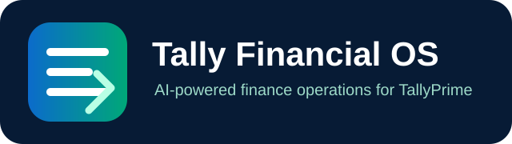
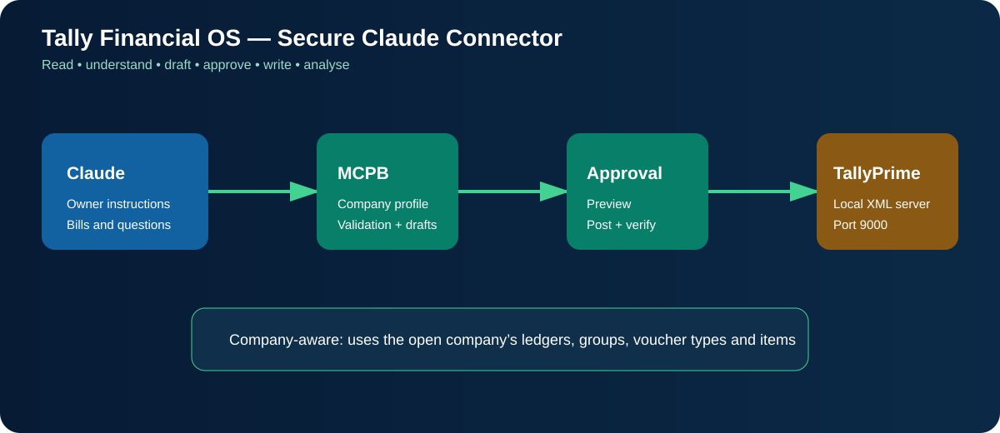
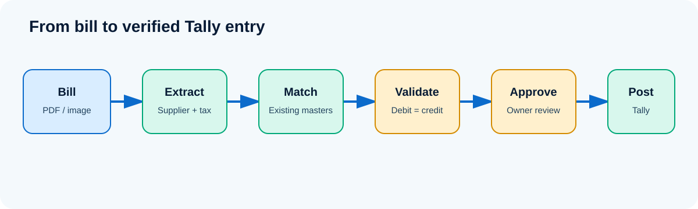
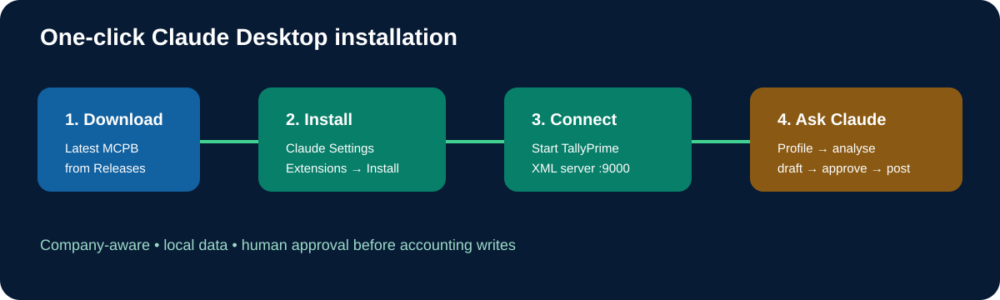

<p align="center">
  
</p>

# Zenastra LedgerPilot — TallyPrime MCP

AI-powered TallyPrime finance operations for Claude Desktop. Read company data, analyse accounts, prepare company-aware voucher drafts, approve them, and write approved entries back to TallyPrime.

Built for companies moving from **₹10 crore to ₹100 crore and beyond**.

<p align="center">
  
</p>

## Download

- **[One-click Claude Desktop installer (.mcpb)](https://github.com/raghavhavefun/zenastra-ledgerpilot/releases/latest/download/tally-prime-financial-os.mcpb)**
- **[Latest release](https://github.com/raghavhavefun/zenastra-ledgerpilot/releases/latest)**
- **[Manual installation source](https://github.com/raghavhavefun/zenastra-ledgerpilot/archive/refs/heads/main.zip)**

## What this Tally MCP does

### Read and analyse TallyPrime

Ask Claude:

- “Show customers overdue by more than ₹10 lakh.”
- “Compare this quarter’s expenses with last quarter.”
- “Explain the largest changes in profit and loss.”
- “Show the trial balance and balance sheet for this period.”
- “Which stock items are slow-moving?”
- “Find unusual ledger transactions.”
- “Show the current company’s ledgers, groups, voucher types and stock items.”

Available reporting capabilities include:

- Company and master lookup
- Dynamic collection queries
- SQL analysis of cached reports
- Chart of accounts
- Trial balance
- Profit and loss
- Balance sheet
- Stock summary
- Ledger balance
- Stock-item balance
- Receivables and payables outstanding
- Ledger account statements
- Stock-item account statements
- Ledger create/update
- Master deletion
- Company and period context

### Company-aware writing

The write workflow uses the company structure available in TallyPrime:

```text
Read active company
  → Read ledgers, groups and voucher types
  → Validate exact company masters
  → Create voucher draft
  → Preview accounting impact
  → Authorised user approves
  → Post to TallyPrime
  → Verify company context and result
```

Write tools:

- `company-context` — identifies the available and active company.
- `company-profile` — reads ledgers, groups, voucher types, stock items, units and godowns.
- `voucher-draft-create` — validates voucher type, ledgers, date, amounts and debit/credit balance.
- `voucher-draft-preview` — shows the proposed entry before posting.
- `voucher-draft-approve` — explicit approval step.
- `voucher-draft-post` — posts only an approved draft after rechecking the company.
- `voucher-draft-discard` — removes an unposted draft.
- `voucher-drafts-list` — lists persisted drafts.
- `audit-log` — returns persisted draft and posting audit events.
- `ledger-create-update` — creates or updates ledger masters.
- `delete-master` — deletes supported master records; use with care.

<p align="center">
  
</p>

## How this can reduce finance cost

For a ₹10 crore–₹1,000 crore company, the connector can help identify:

- Overdue receivables and cash trapped in customers
- Duplicate or unusual accounting entries
- Excess, slow-moving and ageing inventory
- Reporting delays and repetitive finance work
- Ledger and classification errors
- GST data inconsistencies requiring review
- Expense and margin changes requiring management action

The financial opportunity may range from lakhs to crores depending on transaction volume, leakage, working-capital discipline and existing manual cost. Results should be measured against the company’s own baseline.

## Requirements

- TallyPrime Silver or Gold
- TallyPrime running on the customer computer or server
- TallyPrime XML server enabled
- TallyPrime configured as **Server**
- Default XML port: `9000`
- Claude Desktop with MCP extension support

TallyPrime must be running and reachable. The required company must be available in TallyPrime. Tally does not necessarily need to be the foreground window, but the Tally process and XML server must be active.

## One-click installation — Claude Desktop

<p align="center">
  
</p>

1. Download the [latest `.mcpb` installer](https://github.com/raghavhavefun/zenastra-ledgerpilot/releases/latest/download/tally-prime-financial-os.mcpb).
2. Open Claude Desktop.
3. Go to **Settings → Extensions**.
4. Open **Advanced settings**, if shown.
5. Click **Install extension**.
6. Select `tally-prime-financial-os.mcpb`.
7. Confirm installation.
8. Start TallyPrime and enable its XML server on port `9000`.
9. Make the required company available.
10. Enable **Tally Prime Financial OS** in Claude.
11. Ask Claude to run `company-profile` first.

## Manual installation — Claude Desktop

### 1. Install Node.js

Install Node.js 20 or newer from:

[https://nodejs.org/en/download](https://nodejs.org/en/download)

### 2. Download the project

```bash
git clone https://github.com/raghavhavefun/zenastra-ledgerpilot.git
cd zenastra-ledgerpilot
npm ci
npm run build
```

Or download the [source ZIP](https://github.com/raghavhavefun/zenastra-ledgerpilot/archive/refs/heads/main.zip) and extract it.

### 3. Configure Claude Desktop

Add this to Claude Desktop’s MCP configuration:

```json
{
  "mcpServers": {
    "Zenastra LedgerPilot": {
      "command": "node",
      "args": ["/absolute/path/to/zenastra-ledgerpilot/dist/index.mjs"]
    }
  }
}
```

Replace the path with the actual absolute path, then restart Claude Desktop.

## TallyPrime XML server setup

In TallyPrime, open the connectivity settings and configure:

```text
TallyPrime acts as: Server
Port: 9000
```

Test the local connection:

```bash
curl http://localhost:9000
```

If the connection fails, check:

- TallyPrime is running.
- XML server is enabled.
- TallyPrime is configured as Server.
- Port `9000` is available.
- The required company is available.

## Build the Claude installer

```bash
npm ci
npm run test
npm run package:mcpb
```

The installer is created at:

```text
dist/tally-prime-financial-os.mcpb
```

## Local data and security

- Keep TallyPrime’s unauthenticated XML port local.
- Do not expose port `9000` directly to the public internet.
- Use a customer-side connector or authenticated outbound tunnel for remote access.
- Back up the company before enabling write or delete tools.
- Review every draft before approval.
- Use `audit-log` to review draft and posting events.
- Drafts and audit data are stored locally under `LEDGERPILOT_STATE_DIR`, or under `~/.zenastra-ledgerpilot` by default.

## Zenastra Industries

- Website: https://zenastraindustries.com
- General support: `contact@zenastraindustries.com`
- CEO: `raghav22062003ss@gmail.com`
- WhatsApp: `+91 93308 60396`
- LinkedIn: https://in.linkedin.com/in/raghav-agarwal-86854521b

## Verification details

- CIN: `U62090WB2025PTC280868`
- GSTIN: `19AACCZ6798B1ZT`
- DPIIT: `DIPP213909`

## License

This is proprietary commercial software from Zenastra Industries. Upstream and third-party notices are preserved in `THIRD_PARTY_NOTICES.md`. Commercial use requires written permission.

## Disclaimer

This connector accelerates finance operations and analysis. Authorised company users remain responsible for accounting classifications, statutory filings, approvals, backups and final decisions.

## Upstream project

This project extends the public TallyPrime MCP pattern created by Dhananjay Gokhale:

[https://github.com/dhananjay1405/tally-mcp-server](https://github.com/dhananjay1405/tally-mcp-server)

Built by **Zenastra Industries** for TallyPrime finance teams that want faster reporting, controlled writing and better operating visibility.
