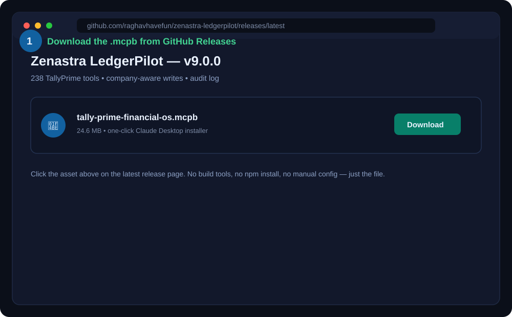
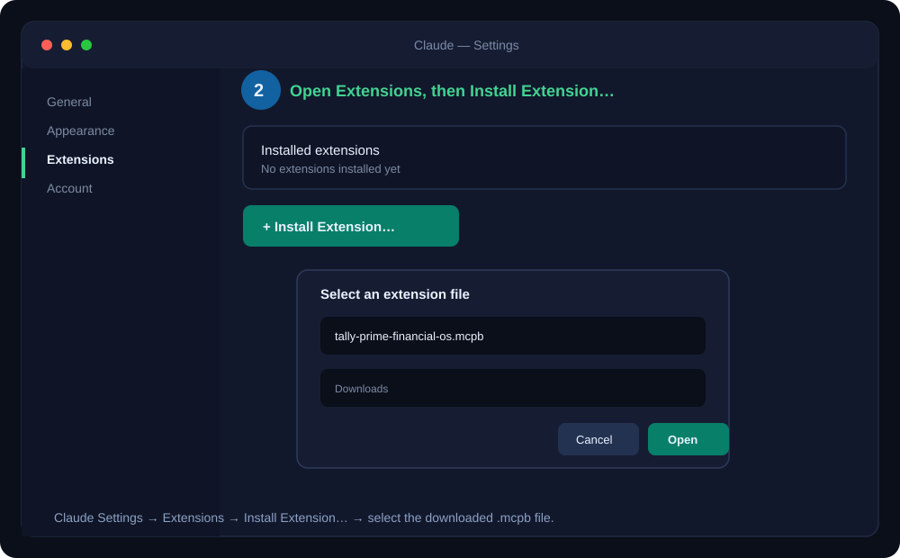
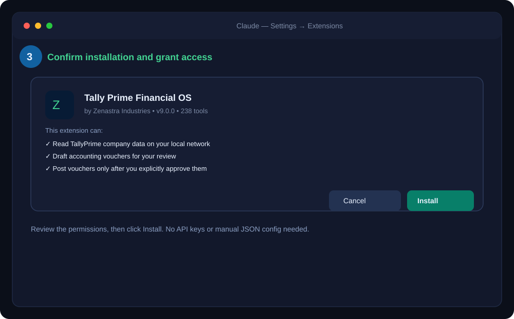
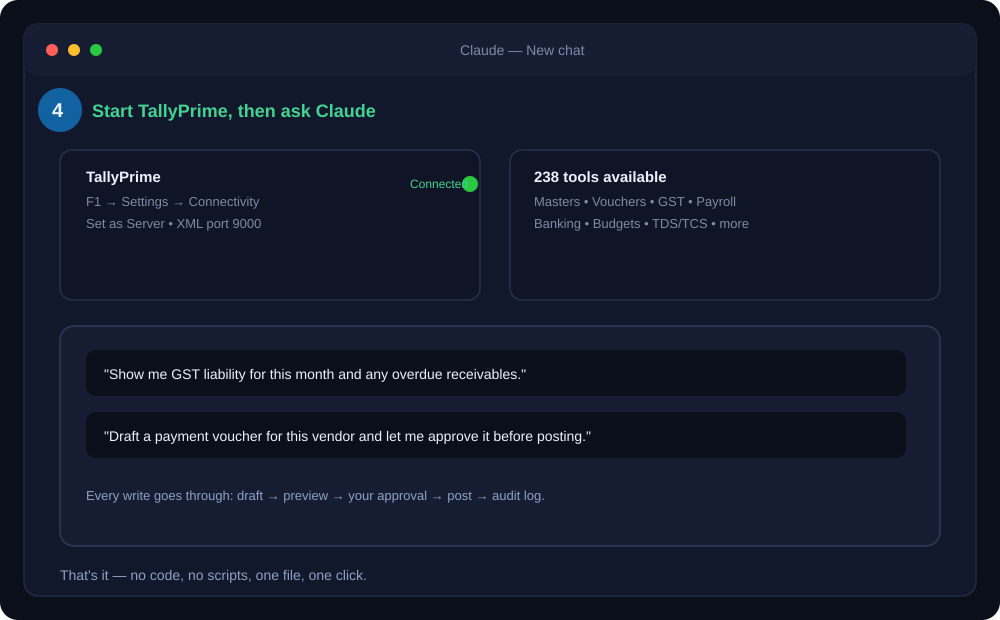

<p align="center">
  
</p>

# Zenastra LedgerPilot — TallyPrime MCP

AI-powered TallyPrime finance operations for Claude Desktop. **238 tools** covering full read/report coverage across Masters, Vouchers, Orders, Financial & Inventory Reports, Receivables/Payables, GST, TDS/TCS, Payroll, Manufacturing, Banking, Budgets, Security, Bulk Operations and a custom TDL Query Engine — plus a company-aware, human-approved write workflow for posting real accounting entries.

Built for companies moving from **₹10 crore to ₹100 crore and beyond**.

<p align="center">
  
</p>

## Download

- **[One-click Claude Desktop installer (.mcpb)](https://github.com/raghavhavefun/zenastra-ledgerpilot/releases/latest/download/tally-prime-financial-os.mcpb)**
- **[Latest release](https://github.com/raghavhavefun/zenastra-ledgerpilot/releases/latest)**
- **[Manual installation source](https://github.com/raghavhavefun/zenastra-ledgerpilot/archive/refs/heads/main.zip)**

## What this Tally MCP does

### Read, analyse and report across every module

Ask Claude:

- "Show customers overdue by more than ₹10 lakh, with ageing buckets."
- "Compare this quarter's expenses with last quarter."
- "Explain the largest changes in profit and loss."
- "Show the trial balance and balance sheet for this period."
- "Which stock items are slow-moving, near expiry, or due for reorder?"
- "Pull my GSTR-1 B2B data and check for reconciliation mismatches."
- "Generate the payroll register and PF/ESI statutory reports for this month."
- "Show unreconciled bank transactions and current cash position."
- "Find unusual ledger transactions."
- "Show the current company's ledgers, groups, voucher types and stock items."

### Full tool coverage (238 tools across 17 modules)

| Module | Tools | What it covers |
|---|---|---|
| Company & Context | 10 | Active company detection, company profile, period context, connection health |
| Masters | 28 | Ledgers, groups, stock items, units, godowns, cost centres, currencies — create/alter/delete/list |
| Vouchers | 16 | Sales, purchase, receipt, payment, journal, contra, credit/debit notes |
| Orders | 10 | Sales/purchase orders, delivery/receipt notes, rejections |
| Financial Reports | 15 | Trial balance, P&L, balance sheet, cash flow, funds flow, daybook, ratio analysis, budget variance |
| Inventory Reports | 10 | Stock summary, movement, batch, expiry, reorder alerts, valuation |
| Outstanding / Receivables | 8 | Receivables, payables, ageing analysis, bill-wise, overdue tracking, interest calculation |
| GST | 18 | GSTR-1/2A/2B/3B, HSN summary, e-Invoice, e-Way Bill, ITC, reconciliation, GSTIN verification |
| TDS/TCS | 12 | Computation, statutory forms (26Q/27Q/16), challans, PAN verification |
| Payroll | 20 | Employees, pay heads, salary structures, payslips, PF/ESI/gratuity, attendance |
| Manufacturing | 14 | BOM, production, consumption, job costing, yield analysis |
| Banking | 10 | Bank reconciliation, cheque register, PDCs, cash position |
| Budgets | 8 | Budget CRUD, variance, utilization, scenario reports |
| Security | 8 | Users, audit trail, altered/deleted voucher logs, exceptions |
| Bulk Operations | 12 | Batch create/update/delete for masters & vouchers |
| TDL Query Engine | 12 | Custom queries, inline TDL, raw XML, search, reference lookups |
| Company-aware writes | 7 | Draft → preview → approve → post → discard, with audit log (see below) |

### Company-aware writing

Every write goes through an explicit approval gate before anything touches your books:

```text
Read active company
  → Read ledgers, groups and voucher types
  → Validate exact company masters
  → Create voucher draft
  → Preview accounting impact
  → Authorised user approves
  → Post to TallyPrime
  → Verify company context and result
  → Logged in audit-log
```

Write tools:

- `company-context` — identifies the available and active company.
- `company-profile` — reads ledgers, groups, voucher types, stock items, units and godowns.
- `voucher-draft-create` — validates voucher type, ledgers, date, amounts and debit/credit balance.
- `voucher-draft-preview` — shows the proposed entry before posting.
- `voucher-draft-approve` — explicit approval step.
- `voucher-draft-post` — posts only an approved draft after rechecking the company.
- `voucher-draft-discard` — removes an unposted draft.
- `voucher-drafts-list` — lists persisted drafts.
- `audit-log` — returns persisted draft and posting audit events.
- `ledger-create-update` — creates or updates ledger masters.
- `delete-master` — deletes supported master records; use with care.

Nothing is posted to TallyPrime without a human explicitly approving the exact entry first. This is the core difference between this connector and simply letting an AI have raw write access to your books.

<p align="center">
  
</p>

## How this helps a growing company

A finance team using this connector typically replaces several separate, manual workflows with one AI conversation:

- **Faster filings** — GST returns, HSN summaries, and TDS/TCS forms are assembled directly from live Tally data instead of manually exported and re-keyed into spreadsheets.
- **Fewer missed credits and errors** — ITC reconciliation, GST exception tracking, and ledger classification checks surface issues before a return is filed, not after a notice arrives.
- **Less time on reconciliation** — bank reconciliation, ageing analysis, and unusual-transaction detection run on demand instead of at month-end crunch.
- **Reduced dependency on external consultants for routine reporting** — trial balance, P&L, balance sheet, budget variance and payroll statutory reports are available instantly, in conversation, instead of requested-and-waited-for.
- **Controlled automation, not blind automation** — every accounting write is drafted, previewed, and requires explicit human approval before it touches your books, with a full audit trail.
- **Visibility a small, uncoordinated finance team usually can't keep up with** — company-wide receivables ageing, inventory reorder points, and budget-vs-actual are queryable instantly instead of chased across disconnected reports.

The financial opportunity — cost saved on manual reporting and consultants, revenue protected from leakage, and time reclaimed for higher-value work — depends entirely on a company's own transaction volume, current manual overhead, and existing process discipline. We do not publish a generic savings percentage because the honest answer is: it depends on your books. Connect with us for a diagnostic against your own data.

## Requirements

- TallyPrime Silver or Gold
- TallyPrime running on the customer computer or server
- TallyPrime XML server enabled
- TallyPrime configured as **Server**
- Default XML port: `9000`
- Claude Desktop with MCP extension support

TallyPrime must be running and reachable. The required company must be available in TallyPrime. Tally does not necessarily need to be the foreground window, but the Tally process and XML server must be active.

## One-click installation — Claude Desktop

<p align="center">
  
</p>

### Step 1 — Download the installer

<p align="center">
  
</p>

### Step 2 — Open Extensions in Claude Desktop

<p align="center">
  
</p>

### Step 3 — Confirm installation

<p align="center">
  
</p>

### Step 4 — Start TallyPrime and connect

<p align="center">
  
</p>

1. Download the [latest `.mcpb` installer](https://github.com/raghavhavefun/zenastra-ledgerpilot/releases/latest/download/tally-prime-financial-os.mcpb).
2. Open Claude Desktop.
3. Go to **Settings → Extensions**.
4. Open **Advanced settings**, if shown.
5. Click **Install extension**.
6. Select `tally-prime-financial-os.mcpb`.
7. Confirm installation.
8. Start TallyPrime and enable its XML server on port `9000`.
9. Make the required company available.
10. Enable **Tally Prime Financial OS** in Claude.
11. Ask Claude to run `company-profile` first.

## Manual installation — Claude Desktop

### 1. Install Node.js

Install Node.js 20 or newer from:

[https://nodejs.org/en/download](https://nodejs.org/en/download)

### 2. Download the project

```bash
git clone https://github.com/raghavhavefun/zenastra-ledgerpilot.git
cd zenastra-ledgerpilot
npm ci
npm run build
```

Or download the [source ZIP](https://github.com/raghavhavefun/zenastra-ledgerpilot/archive/refs/heads/main.zip) and extract it.

### 3. Configure Claude Desktop

Add this to Claude Desktop's MCP configuration:

```json
{
  "mcpServers": {
    "Zenastra LedgerPilot": {
      "command": "node",
      "args": ["/absolute/path/to/zenastra-ledgerpilot/dist/index.mjs"]
    }
  }
}
```

Replace the path with the actual absolute path, then restart Claude Desktop.

## TallyPrime XML server setup

In TallyPrime, open the connectivity settings and configure:

```text
TallyPrime acts as: Server
Port: 9000
```

Test the local connection:

```bash
curl http://localhost:9000
```

If the connection fails, check:

- TallyPrime is running.
- XML server is enabled.
- TallyPrime is configured as Server.
- Port `9000` is available.
- The required company is available.

## Build the Claude installer

```bash
npm ci
npm run test
npm run package:mcpb
```

The installer is created at:

```text
dist/tally-prime-financial-os.mcpb
```

## Local data and security

- Keep TallyPrime's unauthenticated XML port local.
- Do not expose port `9000` directly to the public internet.
- Use a customer-side connector or authenticated outbound tunnel for remote access.
- Back up the company before enabling write or delete tools.
- Review every draft before approval.
- Use `audit-log` to review draft and posting events.
- Drafts and audit data are stored locally under `LEDGERPILOT_STATE_DIR`, or under `~/.zenastra-ledgerpilot` by default.

## Zenastra Industries

- Website: https://zenastraindustries.com
- General support: `contact@zenastraindustries.com`
- CEO: `raghav22062003ss@gmail.com`
- WhatsApp: `+91 93308 60396`
- LinkedIn: https://in.linkedin.com/in/raghav-agarwal-86854521b

## Verification details

- CIN: `U62090WB2025PTC280868`
- GSTIN: `19AACCZ6798B1ZT`
- DPIIT: `DIPP213909`

## License

This is proprietary commercial software from Zenastra Industries. Upstream and third-party notices are preserved in `THIRD_PARTY_NOTICES.md`. Commercial use requires written permission.

## Disclaimer

This connector accelerates finance operations and analysis. Authorised company users remain responsible for accounting classifications, statutory filings, approvals, backups and final decisions.

## Upstream projects

This project extends the public TallyPrime MCP pattern created by Dhananjay Gokhale:

[https://github.com/dhananjay1405/tally-mcp-server](https://github.com/dhananjay1405/tally-mcp-server)

The v9.0.0 read/report/master tool layer (238 tools across 17 modules) additionally incorporates and extends the TallyPrime MCP server architecture published by Anshveer Turna:

[https://github.com/anshveerturna/tally-mcp](https://github.com/anshveerturna/tally-mcp)

Built by **Zenastra Industries** for TallyPrime finance teams that want faster reporting, controlled writing and better operating visibility.
